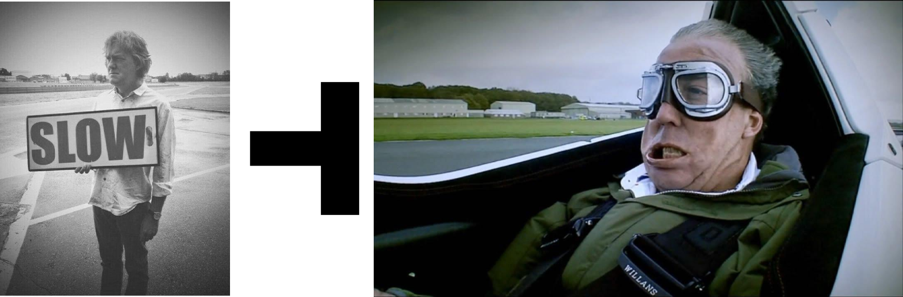
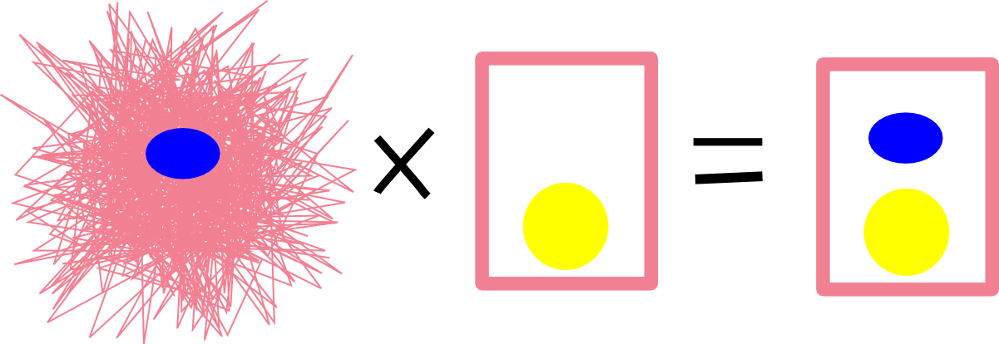
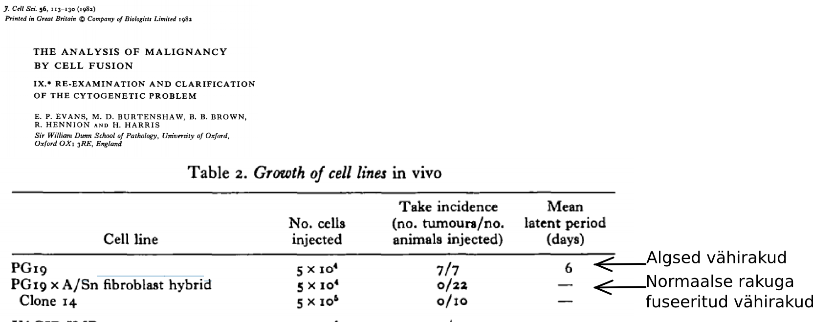
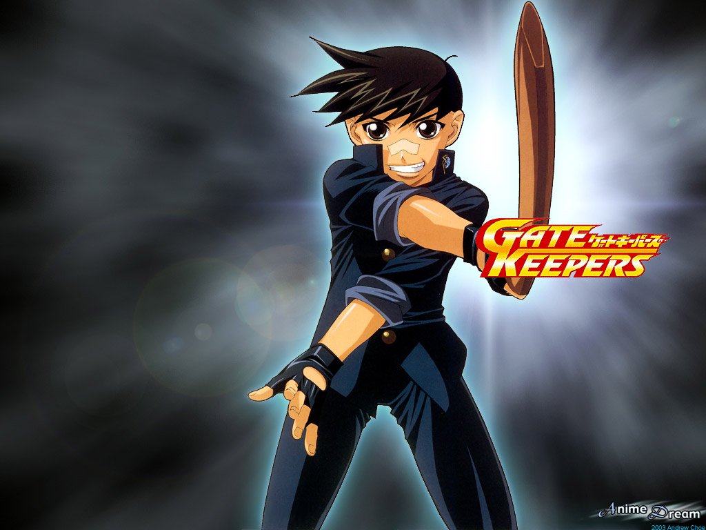

```{r, include=FALSE}
knitr::opts_chunk$set(echo = FALSE, message = FALSE, fig.align = 'center')
```


class: inverse, middle, center

# Recap

---

## Ras aktivatsioon RTK poolt on vahendatud üle fosfo-türosiini siduvate adaptervalkude

- türosiinkinaas retseptor-P $\rightarrow$ SH2-Shc-P $\rightarrow$ SH2-Grb2-SH3 $\rightarrow$ proline-rich-Sos $\rightarrow$ Ras
- türosiinkinaas retseptor-P $\rightarrow$ SH2-Grb2-SH3 $\rightarrow$ proline-rich-Sos $\rightarrow$ Ras

```{r, out.width=500}
knitr::include_graphics("http://www.nature.com/nrm/journal/v13/n1/images/nrm3255-f1.jpg")
```

---
## Ras aktiveerib kolm põhilist signaalirada

.pull-left[

Aktiveeritud Ras seotub ja aktiveerib oma effektorvalke:
- **Raf kinaas**
- **Fosfatidüülinositool 3 kinaas, PI3K**
- **RalGDS (Ral GEF)**


```{r}
knitr::include_graphics("http://ars.els-cdn.com/content/image/1-s2.0-S1535610814000816-gr1.jpg")
```
]

.pull-right[

```{r, out.width=200}
knitr::include_graphics("assets/img/RasPI3K.jpg")
```
]

---
class: inverse, middle, center

# Tuumorsupressorgeenid

---
## Geenide osa vähis on kahesuunaline

.pull-left[

```{r, out.width = 200}
knitr::include_graphics("https://upload.wikimedia.org/wikipedia/commons/thumb/6/63/Theodor_Boveri.jpg/800px-Theodor_Boveri.jpg")
```

Theodor Boveri (1862-1915), Saksa bioloog
]
.pull-right[

- Töötas merisiiliku mudeliga.

- Leidis, et kõik kromosoomid on vajalikud normaalseks embrüogeneesiks.

- Osad kromosoomid stimuleerivad rakkude jagunemist ja osad kromosoomid inhibeerivad.

]
---
## Tuumorsupressorgeenid

- Lisaks onkogeenidele on vähiga seotud ka teine klass geene **tuumorsupressorgeenid** (TSG).

- TSG-g toimivad onkogeenidele vastupidiselt, kontrollides ja pidurdades onkogeenide funktsiooni.

- Normaalsetes rakkudes on onkogeenide ja tuumorsupressorgeenide toime tasakaalus ja rakkude jagunemine toimub kontrollitult.

```{r}

```

---
## Rakkude fuseerimine ja tumorigeenne fenotüüp
**Normaalsete ja vähirakkude fuseerumisel saadud hübriidsed rakud kaotasid tumorigeensuse!**

- Rakkude fuseerimist kasutati transformeerunud fenotüübi uurimiseks: vähirakke fuseeriti normaalsete rakkudega.
- Rakkude fuseerumise võib indutseerida kasutades viiruseid või keemiliselt PEG-iga.
- Saadakse hübriidsed rakud e. sünsüütsiumid.

```{r}

```

---
## Tumorigeenne fenotüüp on retsessiivne
Vähiraku fuseerimisel normaalse rakuga saadud tulemused

- Geeni mutantne alleel on metsik-tüüpi alleeli olemasolul retsessiivne,
- Metsik tüüpi alleel hoiab rakus ära tumorigeense fenotüübi avaldumise, siis ka nimetus tuumorsupressorgeen
- Tuumorsupressorgeeni funktsiooni kadu toimub rakus ainult selle geeni mõlema alleeli muteerumise läbi

```{r, out.width=560}

```

---
## Raku fuusion eksperimentide paradoks

- Vähisündroomid (retinoblastoom, Li-Fraumeni, neurofibromatoos) on dominantse pärilikusega: pärilikku vähi mutatsiooni kandvad indiviidid saavad peaaegu kindlasti vähi.

- Tuumorsupressorgeenid aga toimivad raku tasemel retsessiivselt: ühe alleeli mutatsioon ei ole piisav raku transformeerumiseks.

---
## Retinoblastoom

- Retinoblastoom on lapseea vähisündroom mis tekib reetina fotoretseptorite ja ganglionite eellasrakkudes.
- Intsidents üks juht 15000 kuni 20000 sünni kohta.
- Arenenud maades keskmine iga diagnoosil 27 kuud unilateraalse vormi korral ja 15 kuud bilateraalse vormi korral.

.pull-left[

```{r}
knitr::include_graphics("http://ascopubs.org/na101/home/literatum/publisher/asco/journals/content/jco/2005/jco.2005.03.23.issue-10/jco.2005.05.054/20161107/images/large/zlj0100520420001.jpeg")
```

.footer[doi: 10.1200/JCO.2005.05.054]
]
.pull-right[

**Päriliku Rb patsientidel on vähirisk suurem.**

- 50 aastat peale retinoblastoomi diagnoosi ja ravi avastatakse 36% päriliku Rb patsientidest mõni teine kasvaja, samas sporaadilise Rb patsientidest ainult 5.7%. 
]
---
## Knudson: *Statistical Study of Retinoblastoma*

- Tõenäosus, et pärilikku mutatsiooni kandev reetinarakk moodustab kasvaja:

    - $\frac{2\times10^{-6} ganglionirakku \times 2 silma}{3 kasvajat/patsient} = 0.75\times10^-6$.


- Arvestades, et enamus retinoblastoome tekib esimese 2 eluaasta jooksul, siis ühe mutatsiooni tõenäosus ca $2\times10^{-7}$

---
## Distribution of retinoblastoma cases by type and laterality


RB Type |Bilateral	| Unilateral	| Total
---|----------|-------------|------
Hereditary|	25%–30%	|10%–15%	|35%–45%
Nonhereditary|	0	|55%–65%|	55%–65%
Total|	25%–30%	|70%–75%	|100%


---
## Retinoblastoomide tekke kineetika

.pull-left[

```{r, out.width = 260, fig.cap="A New Theory on the Cancer-inducing Mechanism"}
knitr::include_graphics("assets/img/Knudson_Rb.png")
```
]

.pull-right[

- Bilateraalsed retinoblastoomid tekivad ühe mutatsiooni (esimese järgu) kineetika järgi.

- Unilateraalsed tekivad kahe mutatsiooni (teise järgu) kineetika järgi.

]

.footer[Alfred G. Knudson, Jr. Mutation and Cancer: Statistical Study of Retinoblastoma. Proc Natl Acad Sci U S A. Apr 1971; 68(4): 820–823.]

---
class: inverse, middle, center

# Tuumorsupressorgeenide väljalülitumise mehhanismid

---
## Geeni mõlema alleeli muteerumine on väga ebatõenäoline

.pull-left[

- Retinoblastoomi puhul ühe mutatsiooni tõenäosus geenis $2\times10^{-7}$.

- Mõlema alleeli muteerumise tõenäosus on seega $10^{-14}$.

- Kuidas siis retinoblastoomid tekkida saavad? Välk ju ei löö ometi kunagi teist korda samasse kohta...

]

.pull-right[

```{r, out.width = 200}
knitr::include_graphics("http://upload.wikimedia.org/wikipedia/commons/thumb/b/bc/Lightning_striking_the_Eiffel_Tower_-_NOAA_edit.jpg/640px-Lightning_striking_the_Eiffel_Tower_-_NOAA_edit.jpg")
```
]

.footer[Pilt: wikimedia.]

---
## rb alleeli mitootiline krossingover

- Mitootilise krossingoveri tõenäosus on paar suurusjärku kõrgem kui mutatsioonil

```{r}
knitr::include_graphics("http://wiki.ggc.edu/images/3/30/Retinoblastoma_beggining_pic.jpg")
```

---
## TSG mutatsioonid

- Mehhanismid mis viivad tuumorsupressorgeeni ühe alleeli 'välja lülitamiseni on

    - mutatsioonid ja 
    - promootori metülatsioon.

- Ühe geenikoopia kadumisele võib järgneda teise alleeli kadu, mis toimub 
    - teise mehhanismiga kui _de novo_ mutatsioonid või metülatsioon ja viib heterosügootsuse kadumiseni selles lookuses.

- **Heterosügootsuse kadumine (LOH)** jätab TSG lookusesse kaks mittefunktsionaalset alleeli.

- LOH on märksa sagedasem kui mutatsioonid või metülatsioon

---
## LOH - heterosügootsuse kadu (loss of heterozygosity)

LOH on kromosomaalne muutus milles läheb vahetusse või kaduma geeni lookus ja seda ümbritsev piirkond. LOH tekib läbi erinevate mehhanismide.

.pull-left[

- Mitootiline krossingover.

- Lookuse deletsioon.

- Defektne kromosoomide segregatsioon (*nondisjunction* - õdekromatiidid ei lahkne) ja ühest rakust läheb kr kaduma.

- Geenikonversioon, wt alleel parandatakse valeks.

]
.pull-right[

```{r, out.width = 500}
knitr::include_graphics("http://www.ubooks.pub/Books/B0/E10R1010/MAIN/images/image055.jpg")
```
]

---
## Mitootiline krossingover

.pull-left[

```{r, out.width=180}
knitr::include_graphics("http://upload.wikimedia.org/wikipedia/commons/thumb/c/ca/Mitotic_Recombination_Illustration.jpg/330px-Mitotic_Recombination_Illustration.jpg")
```
]

.pull-right[

- Toimub rakutükli G2/M faasis.

- Rekombineeruvad mitte-õdekromosoomid.

- Tekivad homosügootsed rakud heterosügootses organismis.

]

.footer[Pilt:wikipedia]


---
## LOH ja Rb

- Lisaks lapseea retinoblastoomile on Rb funktsioon sagedasti kadunud ka hiljem erinevat päritolu kasvajates.

- 13q LOH on tavaline kromosomaalne muutus põie, kopsu, rinnanäärme, pea- ja kaela ning teiste organite vähkides.


```{r}
knitr::include_graphics("http://atlasgeneticsoncology.org/Anomalies/Images/13del13qMaG.jpg")
```


.footer[Pilt:atlasgeneticsoncology.org]

---
## Sage ja korduv kromosoomi lookuse *LOH-event* viitab võimalikule TSG-le

```{r}
tab <- readr::read_delim("Genoomi piirk.|Geene piirk.|Märklaud|Sagedasti muteerunud geen = p.value | Funktsioon
9p21.3|4|CDKN2A|CDKN2A = 4.4e-15 | CDK inhibiitor
19p13.3|7|STK11|STK11 = 2.5e-13 | Ser/tre kinaas
6q26|1|PARK2|  | E3 ubiquitin ligaas
1p36.11|2|ARID1A|ARID1A = 1.5e-14 | kromatiini SWI/SNF kompl.
10q23.31|2|PTEN|PTEN = 2.2e-15 | fosfataas
13q14.2|2|RB1|RB1 = 1.7e-13 | E2F TF inhibiitor
4q35.2|1|FAT1|FAT1 = 2.4e-15 | atüüpiline kadheriin
17q11.2|5|NF1|NF1 = 3.3e-13 | Ras GAP
5q15|156|APC|APC=2.6e-13, RASA1=0.0029 | $\beta$-kateniini sidumine
7q36.1|1|MLL3|MLL3 = 1.1e-05 | histooni metüültransferaas
17q21.31|2|BRCA1|BRCA1 = 3.5e-08 | G2/M DNA kontroll
12p13.1|5|CDKN1B|CDKN1B = 2.2e-06 | CDK inhibiitor
18q21.2|3|SMAD4|SMAD4 = 6.6e-15 | transkriptsioonifaktor", delim ="|")
tab <- knitr::kable(tab, format = 'html')
kableExtra::kable_styling(tab, "striped", position = "left", font_size = 10)
```


---
## Vähi genoomi mutatsioonide 'hotspotid'

- Determining how somatic copy number alterations (SCNAs) promote cancer is an important goal. We characterized SCNA patterns in 4,934 cancers from The Cancer Genome Atlas Pan-Cancer data set.

- [Vähkides sagedasti deleteerunud genoomipiirkonnad](http://rpubs.com/tapa741/tuumorsupressorgeenid).

- Pan-cancer patterns of somatic copy number alteration. Travis I Zack, Steven E Schumacher, Scott L Carter, Andrew D Cherniack, Gordon Saksena, Barbara Tabak, Michael S Lawrence, Cheng-Zhong Zhang, Jeremiah Wala, Craig H Mermel, Carrie Sougnez, Stacey B Gabriel, Bryan Hernandez, Hui Shen, Peter W Laird, Gad Getz, Matthew Meyerson & Rameen Beroukhim. Nature Genetics 45, 1134–1140 (2013) doi:10.1038/ng.2760.

---
## DNA metülatsioon
DNA metülatsioon on üks geeni vaigistamise mehhanism

- Vähis metüleeritakse normaalselt mitte-metüleeritud CpG rikkad alad tuumorsupressorgeeni promootoralas.

- Sellist *de novo* metülatsiooni viivad läbi DNA metülaasid.

- DNA hüpermetülatsiooniga CpG-rikates alades kaasneb nukleosoomide asetsemine transkriptsiooni alguspunktis, mis on seotud  vaigistatud geenidega.

- Sagedased metüleeritud TSG on **Von Hippel–Lindau (VHL)** neerukasvajates ja **CDKN2A**.

```{r, out.height=200}
knitr::include_graphics("http://www.ncbi.nlm.nih.gov/pmc/articles/PMC3307543/bin/nihms358721f2.jpg")
```

---
### DNA hüpermetülatsioon vähis on geenispetsiifiline

.pull-left[

```{r fig.keep='last', fig.height=6.5, dev='svg'}
geen <- c("p16INK4a","p14ARF","p15INK4b","MGMT","hMLH1","BRCA1","GSTP1","DAPK","CDH1",
        "TIMP3","p73","APC")
kude <- c("käärsool","rind","munasari","emakas","kops","pea-kael","leukeemia","lümfoom",
        "aju","neer","kusepõis","söögitoru","magu","kõhunääre","maks")
met <- c(41,110,11,66,4,22,6,29,28,89,26,95,1,150,12,25,3,10,6,25,1,11,5,15,8,22,7,18,3,20,37,132,0,20,1,20,4,25,4,62,1,25,1,20,0,22,2,22,5,38,1,20,3,37,31,118,0,20,0,20,0,19,0,16,NA,NA,NA,NA,0,21,NA,NA,93,150,6,25,NA,NA,NA,NA,NA,NA,NA,NA,NA,NA,NA,NA,NA,NA,127,323,0,36,0,23,0,17,18,83,37,116,2,31,15,61,74,213,1,12,2,44,3,14,10,60,2,18,0,59,15,34,0,10,NA,NA,24,56,0,20,NA,NA,3,51,NA,NA,0,15,NA,NA,NA,NA,NA,NA,21,65,NA,NA,2,20,0,18,11,84,11,58,NA,NA,1,22,NA,NA,0,19,NA,NA,NA,NA,NA,NA,NA,NA,NA,NA,NA,NA,NA,NA,0,18,1,23,24,77,0,10,0,20,2,21,0,106,0,10,1,47,1,20,8,35,0,24,1,14,0,22,0,18,13,20,2,23,1,15,2,23,NA,NA,10,64,17,92,8,86,21,29,NA,NA,NA,NA,1,11,NA,NA,NA,NA,NA,NA,0,20,NA,NA,3,88,NA,NA,NA,NA,NA,NA,NA,NA,30,75,NA,NA,NA,NA,NA,NA,NA,NA,26,31,NA,NA,NA,NA,NA,NA,6,22,8,29,NA,NA,NA,NA,4,21,NA,NA,NA,NA,NA,NA,20,77,28,36,NA,NA,NA,NA,NA,NA,NA,NA,1,20,0,10,0,15,NA,NA,NA,NA,0,22,NA,NA,11,35,3,10,0,22,0,10,NA,NA,NA,NA,NA,NA,NA,NA,NA,NA,20,108,1,19,0,20,NA,NA,0,17,0,10,NA,NA,NA,NA,0,10,1,12,2,19,4,27,13,38,6,18,6,18)
hm <- data.frame(Geen = rep(geen, each = 15), 
                 Kasvaja = rep(kude, 12),
                 Met = met[seq(1, length(met), by = 2)],
                 Proove = met[seq(2, length(met), by = 2)])
library(dplyr)
library(ggplot2)
hm <- mutate(hm, Protsent = (Met / Proove) * 100)
hm %>%
  na.omit %>% 
  ggplot(aes(Kasvaja, Protsent, fill = Kasvaja))+
  geom_bar(stat = "identity") +
  facet_wrap(~ Geen, scale = "free_x") +
  theme(axis.text.x = element_text(angle = 90, vjust = 0.5, face = "bold"))
```
]
.pull-right[

```{r}
library(broom)
hm %>% 
  na.omit %>% 
  lm(Protsent ~ Geen + Kasvaja, data = .) %>% 
  anova %>% 
  tidy %>% 
  knitr::kable(format = 'html') %>% 
  kableExtra::kable_styling("striped", position = "left", font_size = 12)
```
]

.footer[Manel Esteller, Paul G. Corn, Stephen B. Baylin, and James G. Herman. A Gene Hypermethylation Profile of Human Cancer. Cancer Res April 15, 2001 61; 3225]

---
class: inverse, middle, center
## Tuumorsupressorgeenid vähis ja vähisündroomides

---
## Paljud TSG-d seotud pärilike vähisündroomidega

```{r}
tab <- readr::read_delim("Genoomipiirkond | Geen | Pärilik sündroom | Sporaadiline vähk | Funktsioon
3p25 | VHL | von Hippel-Lindau sündroom | neeru kartsinoom | HIF-i ubiquitin ligaas
5q15|APC| perekondlik *adenomatous polyposis coli* | käärsool, kõhunääre, magu, eesnääre | $\beta$-kateniini deg.
9p21 | p16INK4a | perekondlik melanoom | erinevad | CDK inhibiitor
10q23.31|PTEN|Cowdeni tõbi, rinna ja GI tuumorid| glioblastoom, eesnääre, rinna ja kilpnäärme vähk | fosfataas
11p13 | WT1 | Wilms tuumor | Wilms tuumor | TF  
13q14.2|RB1|  retinoblastoom, osteosarkoom | põie, kopsu, rinnanäärme, pea- ja kaela vähk | E2F inhibiitor
17p13.1|P53| Li-Fraumeni sündroom | peaegu kõigis vähkides | TF
17q11.2|NF1| neurofibromatoos 1 | käärsool, astrotsütoom | Ras GAP
18q21.2|SMAD4| juveniilne polüpoos | käärsool, kõhunääre | TGF-$\beta$ TF", delim ="|")
tab <- knitr::kable(tab, format = 'html')
kableExtra::kable_styling(tab, "striped", position = "left", font_size = 12)
```


---
## TSG: *gatekeepers* ja  *caretakers*

TSG-g võib funktsiooni alusel jagada '(värava)valvuriteks' ja 'hooldajateks'.

- 'Valvurid' on seotud rakutsükli kontrolliga nt. p16INK4a (CDKN2A), RB, p27Kip1 (CDKN1B), PTEN.

- 'Hooldajad' on seotud kromatiini kontrolli ja genoomi terviklikkuse tagamisega nt. ARID1A, MLL3, BRCA1.

.pull-left[

```{r, out.width = 260, fig.cap="Gatekeeper"}

```
]
.pull-right[

```{r, out.width = 200, fig.cap="Caretaker"}
knitr::include_graphics("https://encrypted-tbn1.gstatic.com/images?q=tbn:ANd9GcSCwsybXcLIfPWP7FVF55KCM0XS9dZUgHdCDX9OejizvD4_h2jChA")
```
]

.footer[Vasakul, pilt: gatekeeperaegis.wikia.com. Paremal, pilt:www.dailyedge.ie]

---
## NF1 on dominantselt päranduv geneetiline haigus

- NF1, esmaskirjeldus Fredrich von Recklinghauseni poolt 1882, on perekondlik **vähisündroom** esinemissagedusega 1 inimesel 3500.

- Kuna **NF1 patsientidel esinevad pärilikud deletsioonid ja teised *loss-of-function* mutatsioonid**, siis klassifitseerub NF1 tuumorsupressorgeeniks.

- Pooltel NF1 patsientidest on perekondlik haigus ja pooled on pärinud *de novo* mutatsiooni.

- Seega on NF1 lookus inimese genoomis mutatsiooniline *hotspot*-i.

- Kooskõlas klassikalise tuumorsupressorgeeni stsenaariumiga, on NF1 patsientidel jälgitav metsik-tüüpi alleeli kadumine LOH-i või *second-hit* somaatilise mutatsiooni teel.

---
# NF1 sümptomid

```{r}
tab <- readr::read_delim("Sümptom  | Rakud | Arenguline päritolu
neurofibroom/MPNSTs	| Schwann rakud | neuraalhari
  | perineuraalrakud |	mesoderm
  | fibroblastid |	mesoderm
  | PNS neuronid	| neuraalhari
'Cafe-au-lait' laigud | melanotsüüdid |	neuraalhari
  | keratinotsüüdid	| ektoderm
Lisch noodulid (iiris)	| melanotsüüdid	| neuraalhari
kognitiivsed defektid	| CNS neuronid |	neuraaltoru
toruluude düsplaasia	| ?	| mesoderm
näokolju düsplaasia |	?	| neuraalhari
feokromotsütoom	| neerupealiste säsi | neuraalhari
müeloidleukeemia |	müeloidrakud	| mesoderm
glioblastoom | astrotsüüdid	| neuraaltoru", delim ="|")
tab <- knitr::kable(tab, format = 'html')
kableExtra::kable_styling(tab, "striped", position = "left", font_size = 14)
```


.footer[Tabel:doi:10.1016/S0092-8674(01)00245-8]

---

## *Cafe-au-lait* laigud

```{r}
knitr::include_graphics("http://nfcenter.wustl.edu/wp-content/uploads/2010/09/0821172c2a45.jpg")
```

.footer[
Pilt: http://nfcenter.wustl.edu/
]

---
## NF1 vastutab neurofibromatoos I tekke eest

- NF1 patsientidel on eelsoodumus erinevate vähivormide tekkele, peamiselt perifeerses- ja kesknärvisüsteemis.

- Patsientidel esineb ka kognitiivseid defekte ja teisi vähiga mitte seotud sümptomeid, mis puudutavad sagedasti neuraalharjast pärit kudesid väljaspool PNS-i.

- Iseloomulik kliiniline tunnus on perifeerse närvi vähk **neurofibroom**.
- 5-10% NF1 patsientidel areneb välja **invasiivne pleksiformne neurofibroom (MPNST)**.

- Lisaks on NF1 patsientidel kõrgenenud risk saada astrotsütoome, feokromotsütoome (*pheochromocytoma*) ja müeloid leukeemiaid.

---
## NF1 on RasGAP

```{r}
knitr::include_graphics("http://ars.els-cdn.com/content/image/1-s2.0-S0092867401002458-gr1.jpg")
```

---
## Normaalne perifeerne närv ja neurofibroomi areng

.pull-left[

```{r}
knitr::include_graphics("http://ars.els-cdn.com/content/image/1-s2.0-S0092867401002458-gr3.jpg")
```
]

.pull-right[
- Perifeerne närv koosneb neuronitest, Schwanni rakkudest, perineuraalrakkudest, fibroblastidest ja sisaldab ka nuumrakke.
- **Neurofibroomides on kõiki närvi rakutüüpe rohkem**. Lisaks on Schwanni rakud dissotseerunud neuronitest ja perineurium on lagunenud.
- Neurofibroomi areng saab alguse teiseset mutatsioonist või LOH-ist Schwanni rakkudes. Schwanni rakkude transformeerumine põhjustab muutused ka teistes rakutüüpides, tingituna siis sõltvusest Schwanni rakkudest või haplopuudulikkusest.
]

---
## APC, perekondlik *adenomatous polyposis coli*

- Perekondlikku/pärilikku *adenomatous polyposis coli* (FAP) vormi iseloomustab rohke polüüpide teke sooles.
- APC geen on muteerunud umbes 60% sporaadilistes kartsinoomides ja adenoomides.
- APC on multidomäänne valk mis seostub mitmete teiste valkudega, nagu β-kateniin, aksiin (*axin*), mikrotuubulid ja tsütoskeleti regulaatoreid EB1 (*end binding 1*) ja IQGAP1,  Asef1 (Rac GEF).
- Enamus (~60%) APC vähimutatsioone asuvad geenis piirkonnas mida nimetatakse '*mutation cluster region (MCR)*' ning põhjustavad valgus C-terminaalse deletsiooni.
- C-terminaalse deletsiooni tagajärjel kaotab APC võime siduda β-kateniini ja mikrotuubuleid.
- β-kateniini või mikrotuubulite sidumine on essentsiaalne tuumorsupressor aktiivsuse seisukohalt.
- Selle APC funktsiooni kadumine põhjustab β-kateniini akumuleerumise tuumas, kus ta toimib TF-ina kompleksis koos TCF (*T-cell factor*) ja LEF (*lymphoid enhancer factor*) transkriptsioonifaktoritega.

---
## APC funktsioone

```{r, warning=FALSE}
tab <- readr::read_delim("Rakuline protsess | wild-type APC toime |	APC geeni deleteerumise või valgu trunkeerumise toime	| APC domäänid	| APC funktsioonid	| Seostuvad valgud	
kanooniline Wnt signaalirada, transkriptsioon |	inhibitsioon |	aktivatsioon (kadu) |	Armadillo kordused; 15- või 20-aa kordused | stimuleerib β-kateniini fosforüleerimise ja degradatsiooni	| β-katenin, GSK3β, aksiin
adhesioon  | stimuleerib |	nõrgendab (kadu)	| Armadillo kordused; 15- või 20-aa kordused |	β-kateniini rakuline jaotumine plasmamembraani, tuuma ja tsütoplasma vahel |	β-kateniin
migratsioon |  stimuleerib |	tugevam stimulatsioon (trunkeeritud) | Armadillo kordused |	Asef1 ja Asef2 aktivatsioon -> Cdc42 aktivatsioon	| Asef1 ja Asef2
kromosoomide lahknemine | korrektne lahknemine	| segregatsioonidefektid (kadu)	| aluseline domään |	kinetohoori funktsiooni regulatsioon	| mikrotorukesed", delim ="|")
tab <- knitr::kable(tab, format = 'html')
kableExtra::kable_styling(tab, "striped", position = "left", font_size = 12)
```


.footer[Tabel:doi: 10.1242/jcs.03485]


---
## APC domäänide funktsioonid ja soolevähi deletsioonid

.pull-left[

- Kanoonilise Wnt signaaliraja liigne aktivatsioon mängib põhilist rolli APC mutatsioonide poolt põhustatud soolevähi tekkes.

- Lisaks on APC-l ouline roll rakkude migratsioonis, adhesioonis ja mitoosis.
]

.pull-right[

```{r, fig.width=260}
knitr::include_graphics("http://jcs.biologists.org/content/120/19/3327/F1.medium.gif")
```
]


---
## Beta-kateniini lagundava kompleksi struktuur

.pull-left[

```{r, out.width = 300}
knitr::include_graphics("http://upload.wikimedia.org/wikipedia/commons/thumb/c/c9/Beta-catenin-ARM-domain-interactions.png/330px-Beta-catenin-ARM-domain-interactions.png")
```
]

.pull-right[

```{r, out.width = 300}
knitr::include_graphics("http://upload.wikimedia.org/wikipedia/commons/thumb/2/2d/Beta-catenin-destruction-complex.png/495px-Beta-catenin-destruction-complex.png")
```
]

.footer[
Pilt: en.wikipedia.org/wiki/Beta-catenin
]

---
## von Hippel-Lindau tuumorsupressorgeen ja neeruvähk

- VHL tuumorsupressorgeen on muteerunud või vaigistatud >50% sporaadilistes neeruvähkides (RCC).
- Pärilikud VHL mutatsioonid põhjustavad sündroomi mida iseloomustab kõrgenenud risk saada veresoonevähk (hemangioblastoom) või RCC.
- VHL inaktivatsioon põhjustab premaliigsete neerutsüstide tekke.
- VHL geenilt kodeeritav valk pVHL on funktsioonilt E3 ubiquitiin ligaasi substraati ära tundev subühik. 
- pVHL vahendab normoksia korral HIF transkriptsioonifaktori proteasoomset lagundamist.

---
## pVHL määrab HIF tf lagundamise 

.pull-left[

- pVHL osaleb stabiilses ubikvitiin ligaasi kompleksis koos valkudega elongin B, elongin C, Cul2, and Rbx1.
- pVHL märklaudadeks on HIF-a perekonna valgud HIF-1/2/3a.
- HIF-a valgud on muidu väga ebastabiilsed, välja arvatud madala hapniku tingimustes.
- Normaalse hapniku tingimustes HIF valgud hüdroksüleeritakse konserveerunud proliinijääkidel. 
- Hüdroksülatsioonireaktsiooni viivad läbi prolüülhüdroksülaasid.
- Proliin-hüdroksüleeritud HIF seostub pVHL-ile ja ubikvitineeritakse.
]
.pull-right[

```{r}
knitr::include_graphics("http://openi.nlm.nih.gov/imgs/512/151/2360036/2360036_6603547f1.png")
```
]

.footer[Pilt:openi.nlm.nih.gov]

---
## HIF on transkriptsioonifaktor

.pull-left[

```{r, out.width = 460}
knitr::include_graphics("http://www.nature.com/nm/journal/v18/n1/images/nm.2631-F1.jpg")
```
]

.pull-right[

- Rakkudes kus puudub pVHL või madala hapniku tingimustes HIF akumuleerub.
- HIF käivitub hüpoksia adaptatsiooniga seotud geenide transkriptsiooni.
- HIF märklaudgeenid on seotud glükoosi metabolismi ja transpordiga (Glut1, glükolüütilised ensüümid), rakuvälise pH regulatsiooniga (CAIX), angiogeneesiga (VEGF), erütropoeesiga (EPO) ja mitogeenid (TGF-a, PDGF-B)
- HIF-2a allaregulatsioon on vajalik ja piisav, et pVHL supresseeriks neeruvähki.

]


.footer[Pilt:openi.nlm.nih.gov]

---
class: inverse, middle, center

# Lingid teistele loengutele

---

class: inverse, middle

.pull-left[

- [Sissejuhatav loeng](http://tpall.github.io/onkobioloogia)
- [Onkoviirused](http://tpall.github.io/Onkoviirused)
- [Onkogeenid](http://tpall.github.io/Onkogeenid)
- [Retseptorid](http://tpall.github.io/Retseptorid)
- [Signaalirajad](http://tpall.github.io/Signaalirajad)
- [Tuumorsupressorgeenid](http://tpall.github.io/Tuumorsupressorid)
- [Rakutsüklikontroll](http://tpall.github.io/Rakutsyklikontroll)

]

.pull-right[

- [p53 ja apoptoos](http://tpall.github.io/p53-ja-apoptoos)
- [Immortalisatsioon](http://tpall.github.io/Immortalisatsioon)
- [Tumorigenees](http://tpall.github.io/Tumorigenees)
- [Genoomiterviklikkus](http://tpall.github.io/Genoomiterviklikkus)
- [Mikrokeskkond](http://tpall.github.io/Mikrokeskkond)
- [Metastaasid](http://tpall.github.io/Metastaas)
- [Immuunsus](http://tpall.github.io/Immuunsus)
- [Vahiravim](http://tpall.github.io/Vahiravim) 

]

.footer[
GitHub repo: [tpall/Tuumorsupressorid](https://github.com/tpall/Tuumorsupressorid)
]
