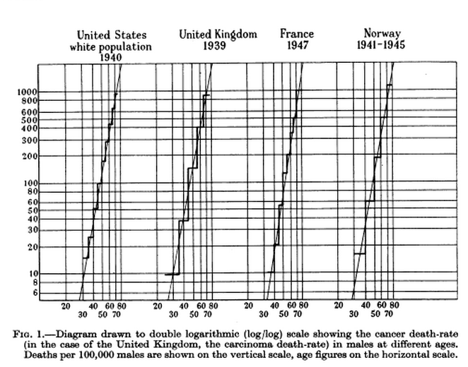
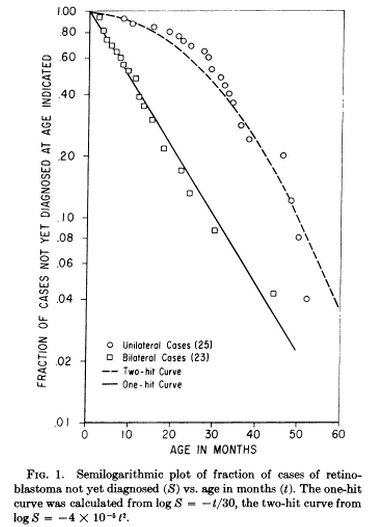
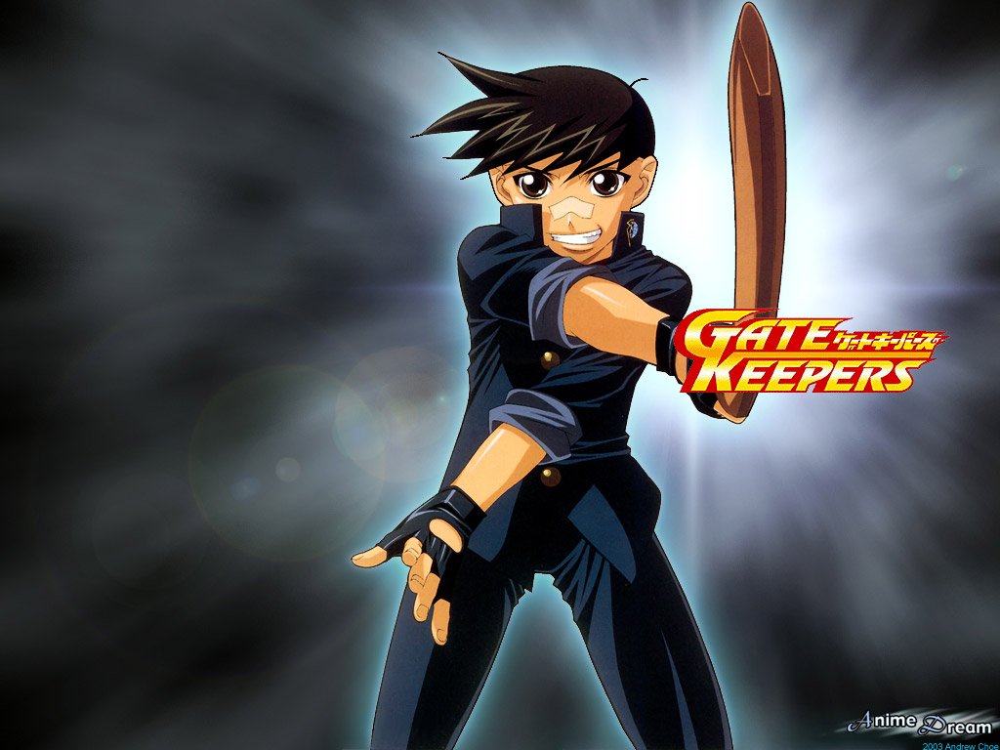
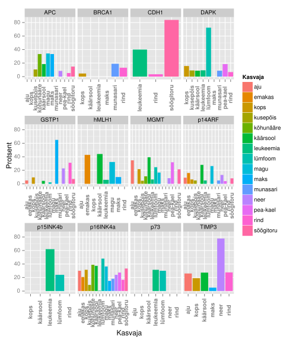

<!-- Limit image width and height -->
<style type="text/css">
img {     
  max-height: 480px;     
  max-width: 600px; 
}
</style>

<style> .title-slide {
  background-color: #FFFFFF; /*#CBE7A5 #EDE0CF; ; #CA9F9D*/
}

.title-slide hgroup > h1{
 font-family: 'Oswald', 'Helvetica', sanserif; 
}

.title-slide hgroup > h1, 
.title-slide hgroup > h2 {
  color: #535E43 ;  /* ; #EF5150*/
}
</style>

<!-- Center image on slide -->
<script type="text/javascript" src="http://ajax.aspnetcdn.com/ajax/jQuery/jquery-1.7.min.js"></script>
<script type="text/javascript">
$(function() {     
  $("p:has(img)").addClass('centered'); 
});
</script>

<!-- Italic -->
<style>
em {
  font-style: italic
}
</style>

<!-- Bold -->
<style>
strong {
  font-weight: bold;
}
</style>

--- .segue .dark .nobackground
## Recap

----
## Signaalirajad


--- .segue .dark .nobackground
## Tuumorsupressorgeenid

---
## Nordling: *Multiple-hit hypothesis*

- Nordling, 1953: kui vähki põhjustab järestikuste mutatsioonide akumuleerumine raku DNA-s siis peab vähiteke olema epidemioloogiliselt seotud vanusega (vanuse astmega).
    - **kahe mutatsiooni** korral on vähk lineaarselt vanusega seotud: $intsidents \sim vanus$, 
    - **seitsme mutatsiooni** korral: $intsidents \sim vanus^{6}$ 


<p style="font-size:12px">C. O. Nordling. A New Theory on the Cancer-inducing Mechanism. Br J Cancer. Mar 1953; 7(1): 68–72.</p>


---&twocol
## Knudsoni hüpotees

- Knudsoni hüpotees (*multiple-hit hypothesis*) oletas, et **vähk tekib mitme (vähemalt kahe) mutatsiooni akumuleerumisel raku DNA-s**.

***=left
- **Alfred G. Knudson** formuleeris oma hüpoteesi 1971.a. Carl O. Nordlingu järgi.
- Knudsoni töö aitas kaudselt kaasa 'vähigeenide' identifitseerimisele. 
- Knudson pälvis oma tööde eest 1998 Albert Laskeri meditsiinipreemia (*Albert Lasker Medical Research Award*).

***=right

<p style="font-size:12px">Foto:wikpedia.</p>

---
## Tumorigeenne fenotüüp on retsessiivne

- 1980. tehtud katsetes leiti, et normaalsete ja vähirakkude fuseerumisel saadud hübriidsed rakud (*syncytium*) kaotasid tumorigeensuse.
- Geeni mutantne alleel on metsik-tüüpi alleeli olemasolul retsessiivne,
    - metsik tüüpi alleel hoiab rakus ära tumorigeense fenotüübi avaldumise, siis ka nimetus **tuumorsupressor geen**.
- **Tuumorsupressorgeeni funktsiooni kadu toimub rakus ainult selle geeni mõlema alleeli muteerumise läbi**.


---&twocol
## Retinoblastoom

- Retinoblastoom on lapseea vähisündroom mis tekib reetina fotoretseptorite ja ganglionite eellasrakkudes.
- Intsidents üks juht 15000 kuni 20000 sünni kohta.
- Arenenud maades keskmine iga diagnoosil 27 kuud unilateraalse vormi korral ja 15 kuud bilateraalse vormi korral.


***=left


<p style="font-size:12px">doi: 10.1200/JCO.2005.05.054</p>

***=right

**Päriliku Rb patsientidel on vähirisk suurem.**
- 50 aastat peale retinoblastoomi diagnoosi ja ravi avastatakse 36% päriliku Rb patsientidest mõni teine kasvaja, samas sporaadilise Rb patsientidest ainult 5.7%. 

---&twocol
## Knudson: *Statistical Study of Retinoblastoma*

- Tõenäosus, et pärilikku mutatsiooni kandev reetinarakk moodustab kasvaja:
    - $\frac{2\times10^{-6} ganglionirakku \times 2 silma}{3 kasvajat/patsient} = 0.75\times10^-6$
- Arvestades, et enamus retinoblastoome tekib esimese 2 eluaasta jooksul, siis ühe mutatsiooni tõenäosus ca $2\times10^{-7}$
- Bilateraalsed: pärilikud (piisab ühest mutatsioonist)
- Unilateraalsed: sporaadilised (kaks mutatsiooni)

***=left




***=right
- Bilateraalsed retinoblastoomid tekivad ühe mutatsiooni (esimese järgu) kineetika järgi $e^{-kt}$
- Unilateraalsed tekivad kahe mutatsiooni (teise järgu) kineetika järgi $e^{-kt^{2}}$

<p style="font-size:12px">Alfred G. Knudson, Jr. Mutation and Cancer: Statistical Study of Retinoblastoma. Proc Natl Acad Sci U S A. Apr 1971; 68(4): 820–823.</p>

---
## Geeni mõlema alleeli muteerumine on väga ebatõenäoline

- Retinoblastoomi puhul ühe mutatsiooni tõenäosus geenis $2\times10^{-7}$
- Mõlema alleeli muteerumise tõenäosus $10^{-14}$

Kuidas siis retinoblastoomid tekkida saavad? Välk ju ei löö ometi kunagi teist korda samasse kohta...


---
## TSG mutatsioonid

- Mehhanismid mis viivad tuumorsupressorgeeni ühe alleeli 'välja lülitamiseni' on 
    - **mutatsioonid** ja 
    - **promootori metülatsioon**.
- Ühe geenikoopia kadumisele võib järgneda teise alleeli kadu, mis toimub 
    - teise mehhanismiga kui *de novo* mutatsioonid või metülatsioon ja viib **heterosügootsuse kadumiseni** selles lookuses.
- **Heterosügootsuse kadumine (LOH)** jätab TSG lookusesse kaks mittefunktsionaalset alleeli.
- LOH on märksa sagedasem kui mutatsioonid või metülatsioon.

---&twocol
## LOH - heterosügootsuse kadu (loss of heterozygosity)

LOH on kromosomaalne muutus milles läheb vahetusse või kaduma geeni lookus ja seda ümbritsev piirkond.

***=left
LOH-il on erinevaid mehhanisme:
- Mitootiline rekombinatsioon,
- Lookuse deletsioon, 
- Defektne kromosoomide segregatsioon (*nondisjunction* - õdekromatiidid ei lahkne), 
- Geenikonversioon.

***=right


**LOH-e ühendavaks teguriks on nendega kaasnev oluliselt kõrgem risk neoplastiliseks transformatsiooniks**.


---&twocol
## Mitootiline rekombinatsioon

***=right

- Toimub rakutükli G2/M faasis.
- Rekombineeruvad mitte-õdekromosoomid.
- Tekivad homosügootsed rakud heterosügootses organismis.

***=left


<p style="font-size:12px">Pilt:wikipedia</p>


---
## LOH ja Rb

- Lisaks lapseea retinoblastoomile on Rb funktsioon on sagedasti kadunud ka hiljem erinevat päritolu kasvajates.
- Üks Rb alleel on tavaliselt juba päriliku või varajase somaatilise mutatsiooni tõttu inaktiivne.
- Heterosügootsuse kadu/LOH vastutab Rb geeni teise alleeli inaktiveerimise eest. 
- 13q LOH on tavaline kromosomaalne muutus põie, kopsu, rinnanäärme, pea- ja kaela ning teiste organite vähkides.


<p style="font-size:12px">Pilt:atlasgeneticsoncology.org</p>

---
# Sage ja korduv mingis kromosoomi piirkonnas toimuv *LOH-event* viitab seal asuvale tuumorsupressorgeenile. 4934 vähki *The Cancer Genome Atlas Pan-Cancer* andmetest.

Genoomi piirk.|Geene piirk.|Märklaud|Sagedasti muteerunud geen = p.value | Funktsioon 
--------------|------------|--------|------------------------------------|-------
9p21.3|4|**CDKN2A**|CDKN2A = 4.4e-15 | CDK inhibiitor
19p13.3|7|**STK11**|STK11 = 2.5e-13 | Ser/tre kinaas
6q26|1|**PARK2**|  | E3 ubiquitin ligaas
1p36.11|2|**ARID1A**|ARID1A = 1.5e-14 | kromatiini SWI/SNF kompl.
10q23.31|2|**PTEN**|PTEN = 2.2e-15 | fosfataas
13q14.2|2|**RB1**|RB1 = 1.7e-13 | E2F TF inhibiitor
4q35.2|1|**FAT1**|FAT1 = 2.4e-15 | atüüpiline kadheriin
17q11.2|5|**NF1**|NF1 = 3.3e-13 | Ras GAP
5q15|156|**APC**|APC=2.6e-13, RASA1=0.0029 | $\beta$-kateniini sidumine
7q36.1|1|**MLL3**|MLL3 = 1.1e-05 | histooni metüültransferaas
17q21.31|2|**BRCA1**|BRCA1 = 3.5e-08 | G2/M DNA kontroll
12p13.1|5|CDKN1B|**CDKN1B** = 2.2e-06 | CDK inhibiitor
18q21.2|3|**SMAD4**|SMAD4 = 6.6e-15 | transkriptsioonifaktor


[Vähkides sagedasti deleteerunud genoomipiirkonnad](http://rpubs.com/tapa741/tuumorsupressorgeenid)

---
# Paljud tuumorsuppressorgeenid seotud pärilike vähisündroomidega

Genoomi piirkond | Geen | Pärilik sündroom | Sporaadiline vähk | Funktsioon
-----------------|------|------------------|-------------------|-----------
3p25 | **VHL** | von Hippel-Lindau sündroom | neeru kartsinoom | HIF-i ubiquitin ligaas
5q15|**APC**| perekondlik *adenomatous polyposis coli* | käärsool, kõhunääre, magu, eesnääre | $\beta$-kateniini deg.
9p21 | **p16INK4a** | perekondlik melanoom | erinevad | CDK inhibiitor
10q23.31|**PTEN**|Cowdeni tõbi, rinna ja GI tuumorid| glioblastoom, eesnääre, rinna ja kilpnäärme vähk | fosfataas
11p13 | **WT1** | Wilms tuumor | Wilms tuumor | TF  
13q14.2|**RB1**|  retinoblastoom, osteosarkoom | põie, kopsu, rinnanäärme, pea- ja kaela vähk | E2F inhibiitor
17p13.1|**P53**| Li-Fraumeni sündroom | peaegu kõigis vähkides | TF
17q11.2|**NF1**| neurofibromatoos 1 | käärsool, astotsütoom | Ras GAP
18q21.2|**SMAD4**| juveniilne polüpoos | käärsool, kõhunääre | TGF-$\beta$ TF

---&twocol
## TSG: *gatekeepers* ja  *caretakers*

TSG-g võib funktsiooni alusel jagada '(värava)valvuriteks' ja 'hooldajateks'.

- 'Valvurid' on seotud rakutsükli kontrolliga nt. p16INK4a (CDKN2A), RB, p27Kip1 (CDKN1B), PTEN
- 'Hooldajad' on seotud kromatiini kontrolli ja genoomi terviklikkuse tagamisega nt. ARID1A, MLL3, BRCA1.


***=left

<p style="font-size:12px">Pilt:gatekeeperaegis.wikia.com</p>

***=right

<p style="font-size:12px">Pilt:www.dailyedge.ie</p>


---
## DNA metülatsioon

DNA metülatsioon on üks geeni vaigistamise mehhanism.
- Vähis metüleeritakse normaalselt mitte-metüleeritud CpG rikkad alad tuumorsupressorgeeni promootor alas.
- Sellist metülatsiooni viivad läbi DNA metülaasid.
- DNA hüpermetülatsiooniga CpG-rikates alades kaasneb nukleosoomide asetsemine transkriptsiooni algusunktis, mis on seotud  vaigistatud geenidega.
- Sagedased metüleeritud TSG on **Von Hippel–Lindau (VHL)** neerukasvajates ja **CDKN2A**. 


--- .codefont &twocol
## DNA hüpermetülatsioon vähis

Geenide **hüpermetülatsioon vähis** ei ole totaalne üle terve kromosoomi või selle regiooni, vaid **toimub geenispetsiifiliselt**, igal geenil individuaalselt.

***=left
 

***=right


```
## Analysis of Variance Table
## 
## Response: Protsent
##           Df Sum Sq Mean Sq F value Pr(>F)  
## Geen      11   7302     664    2.42  0.011 *
## Kasvaja   14   5110     365    1.33  0.206  
## Residuals 90  24684     274                 
## ---
## Signif. codes:  0 '***' 0.001 '**' 0.01 '*' 0.05 '.' 0.1 ' ' 1
```


<p style="font-size:12px">Manel Esteller, Paul G. Corn, Stephen B. Baylin, and James G. Herman. A Gene Hypermethylation Profile of Human Cancer. Cancer Res April 15, 2001 61; 3225</p>

---
## NF1 on dominantselt päranduv geneetiline haigus

- NF1, esmaskirjeldus Fredrich von Recklinghauseni poolt 1882, on perekondlik **vähisündroom** esinemissagedusega 1 inimesel 3500.
- Kuna **NF1 patsientidel esinevad pärilikud deletsioonid ja teised *loss-of-function* mutatsioonid**, siis klassifitseerub NF1 tuumorsupressorgeeniks. 
- Pooltel NF1 patsientidest on perekondlik haigus ja pooled on pärinud *de novo* mutatsiooni. 
- Seega on NF1 lookus inimese genoomis mutatsiooniline *hotspot*-i. 
- Kooskõlas klassikalise tuumorsupressorgeeni stsenaariumiga, on NF1 patsientidel jälgitav metsik-tüüpi alleeli kadumine LOH-i või *second-hit* somaatilise mutatsiooni teel.

---
# NF1 sümptomid

Sümptom  | Rakud | Arenguline päritolu
---------|-------------------------|--------------------------
neurofibroom/MPNSTs	| Schwann rakud | neuraalhari
  | perineuraalrakud |	mesoderm
  | fibroblastid |	mesoderm
  | PNS neuronid	| neuraalhari
*'Cafe-au-lait'* laigud | melanotsüüdid |	neuraalhari
  | keratinotsüüdid	| ektoderm
Lisch noodulid (iiris)	| melanotsüüdid	| neuraalhari
kognitiivsed defektid	| CNS neuronid |	neuraaltoru
toruluude düsplaasia	| ?	| mesoderm
näokolju düsplaasia |	?	| neuraalhari
feokromotsütoom	| neerupealiste säsi | neuraalhari
müeloidleukeemia |	müeloidrakud	| mesoderm
glioblastoom | astrotsüüdid	| neuraaltoru

<p style="font-size:12px">Tabel:doi:10.1016/S0092-8674(01)00245-8</p>

---
## *'Cafe-au-lait'* laigud


<p style="font-size:12px">Pilt:http://nfcenter.wustl.edu/</p>

---
## NF1 vastutab neurofibromatoos I tekke eest

- NF1 patsientidel on eelsoodumus erinevate vähivormide tekkele, peamiselt perifeerses- ja kesknärvisüsteemis.
- Patsientidel esineb ka kognitiivseid defekte ja teisi vähiga mitte seotud sümptomeid, mis puudutavad sagedasti neuraalharjast pärit kudesid väljaspool PNS-i.
- Iseloomulik kliiniline tunnus on perifeerse närvi vähk **neurofibroom**.
- 5-10% NF1 patsientidel areneb välja **invasiivne pleksiformne neurofibroom (MPNST)**.
- Lisaks on NF1 patsientidel kõrgenenud risk saada astrotsütoome, feokromotsütoome (*pheochromocytoma*) ja müeloid leukeemiaid.

---
## NF1 on RasGAP


---&twocol
## Normaalne perifeerne närv ja neurofibroomi areng

***=left


***=right

- Perifeerne närv koosneb neuronitest, Schwanni rakkudest, perineuraalrakkudest, fibroblastidest ja sisaldab ka nuumrakke.
- **Neurofibroomides on kõiki närvi rakutüüpe rohkem**. Lisaks on Schwanni rakud dissotseerunud neuronitest ja perineurium on lagunenud.
- Neurofibroomi areng saab alguse teiseset mutatsioonist või LOH-ist Schwanni rakkudes. Schwanni rakkude transformeerumine põhjustab muutused ka teistes rakutüüpides, tingituna siis sõltvusest Schwanni rakkudest või haplopuudulikkusest.

---
## APC, perekondlik *adenomatous polyposis coli*

- Perekondlikku/pärilikku *adenomatous polyposis coli* (FAP) vormi iseloomustab rohke polüüpide teke sooles.
- APC geen on muteerunud umbes 60% sporaadilistes kartsinoomides ja adenoomides.
- APC on multidomäänne valk mis seostub mitmete teiste valkudega, nagu β-kateniin, aksiin (*axin*), mikrotuubulid ja tsütoskeleti regulaatoreid EB1 (*end binding 1*) ja IQGAP1,  Asef1 (Rac GEF).
- Enamus (~60%) APC vähimutatsioone asuvad geenis piirkonnas mida nimetatakse '*mutation cluster region (MCR)*' ning põhjustavad valgus C-terminaalse deletsiooni.
- C-terminaalse deletsiooni tagajärjel kaotab APC võime siduda β-kateniini ja MT.
- β-kateniini või mikrotuubulite sidumine on essentsiaalne tuumorsupressor aktiivsuse seisukohalt.
- Selle APC funktsiooni kadumine põhjustab β-kateniini akumuleerumise tuumas, kus ta toimib TF-ina kompleksis koos TCF (*T-cell factor*) ja LEF (*lymphoid enhancer factor*) transkriptsioonifaktoritega.

---
# APC funktsioone

Rakuline protsess | wild-type APC toime |	APC geeni deleteerumise või valgu trunkeerumise toime	| APC domäänid	| APC funktsioonid	| Seostuvad valgud	
-------------------|--------------------------|-----------------------------------------|--------|---------------|-------------------
kanooniline Wnt signaalirada, transkriptsioon |	inhibitsioon |	aktivatsioon (kadu) |	Armadillo kordused; 15- või 20-aa kordused | stimuleerib β-kateniini fosforüleerimise ja degradatsiooni	| β-katenin, GSK3β, aksiin
adhesioon  | stimuleerib |	nõrgendab (kadu)	| Armadillo kordused; 15- või 20-aa kordused |	β-kateniini rakuline jaotumine plasmamembraani, tuuma ja tsütoplasma vahel |	β-kateniin
migratsioon |  stimuleerib |	tugevam stimulatsioon (trunkeeritud) | Armadillo kordused |	Asef1 ja Asef2 aktivatsioon $\rightarrow$ Cdc42 aktivatsioon	| Asef1 ja Asef2
kromosoomide lahknemine | korrektne lahknemine	| segregatsioonidefektid (kadu)	| aluseline domään |	kinetohoori funktsiooni regulatsioon	| mikrotorukesed

<p style="font-size:12px">Tabel:doi: 10.1242/jcs.03485</p>


--- &twocol
## APC domäänide funktsioonid ja soolevähi deletsioonid

***=right


***=left

- Kanoonilise Wnt signaaliraja liigne aktivatsioon mängib põhilist rolli APC mutatsioonide poolt põhustatud soolevähi tekkes. 
- Lisaks on APC-l ouline roll rakkude migratsioonis, adhesioonis ja mitoosis.


---&twocol

***=left


<p style="font-size:12px">Pilt:en.wikipedia.org/wiki/Beta-catenin</p>

***=right


---
## The von Hippel-Lindau tumor suppressor gene and kidney cancer

- The von Hippel-Lindau tumor suppressor gene (VHL), which resides on chromosome 3p25, is mutated or silenced in >50% of sporadic clear cell renal cell carcinomas.
- Germ-line VHL mutations give rise to VHL disease, which is characterized by an increased risk of blood vessel tumors (hemangioblastomas) and renal cell carcinomas.
- VHL inactivation gives rise to premalignant renal cysts. Additional genetic alterations are presumably required for conversion of these cysts to renal cell carcinomas. 
- The VHL gene product, pVHL, is the substrate recognition module of an E3 ubiquitin ligase that targets the hypoxia-inducible factor (HIF) for destruction in the presence of oxygen.
- Individuals with von Hippel-Lindau (VHL) disease are at increased risk for developing clear cell carcinoma of the kidney, which is the most common histologic type of renal cancer.

---
## pVHL targets specific proteins for destruction

- pVHL forms stable complexes that contain other proteins called elongin B, elongin C, Cul2, and Rbx1.
- These complexes are capable of directing the covalent attachment of polyubiquitin tails to specific proteins, which serve as signals for such proteins to be degraded by the proteasome.
- pVHL targets have been identified, including the members of the hypoxia-inducible factor (HIF) α family (HIF-1α, HIF-2α, and HIF-3α).
- HIF-α members are highly unstable except under low-oxygen conditions. In the presence of oxygen, these proteins become hydroxylated on conserved prolyl residues in a reaction catalyzed by members of the EGLN family.
- pVHL recognizes the hydroxylated HIF-α species and orchestrates their destruction.

---

- cells that lack pVHL, or when oxygen is limiting, HIF is free to accumulate and activates the transcription of a cadre of genes involved in short-term and long-term adaptation to hypoxia. 
- Included among these genes are genes that control glucose uptake and metabolism (such as the Glut1 glucose transporter and various glycolytic enzymes), extracellular pH (such as carbonic anhydrase IX), angiogenesis (such as vascular endothelial growth factor, VEGF), erythropoiesis (such as erythropoietin), and mitogenesis (such as transforming growth factor α, TGF-α, and platelet-derived growth factor B, PDGF-B).
- down-modulation of HIF-2α is both necessary and sufficient for pVHL to suppress tumor formation by renal cell carcinoma.

---


